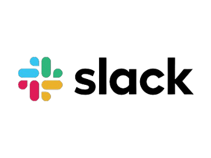

<p align="middle">
  
</p>
<h3 align="middle">Slack-Salesforce Case Workflow: Work OS 기반 고객지원 협업 시스템</h3>

<br/>

## 📝 작품소개

Salesforce에 생성된 고객지원 Case를 Slack으로 확장하여  
조회·판단·처리까지 연결되는 **협업형 Work OS를 구현한 프로젝트**입니다.

단순 알림 전송이 아닌  
**이벤트 발생 → Slack 알림 → 사용자 액션 → Salesforce 처리 → 결과 피드백**까지 이어지는  
양방향 워크플로우 구조를 설계하고 구현하였습니다.

Slack을 단순 커뮤니케이션 도구가 아닌  
**CRM 업무를 실행하는 인터페이스로 활용**하는 것을 목표로 구성하였습니다.

<br/>

## 🌁 프로젝트 배경

### 협업툴 중심 업무 전환의 필요성

기존 CRM 업무는 Salesforce에 직접 접속하여  
데이터 조회 및 처리를 수행하는 방식이 일반적입니다.

하지만 실무 환경에서는 Slack과 같은 협업툴에서  
업무 알림을 받고 의사결정을 진행하는 경우가 많으며,

이 과정에서  
- CRM과 협업툴 간의 단절  
- 반복적인 시스템 이동  
- 처리 지연  

과 같은 비효율이 발생합니다.

---

### 🎯 프로젝트 목표 (TO-BE)

**1. 실시간 협업 기반 고객지원 처리**
- Case 발생 즉시 Slack으로 알림을 전달하고  
  Slack에서 바로 후속 처리 수행 가능하도록 구성

**2. CRM 데이터의 Work OS 확장**
- Salesforce 데이터를 Slack으로 확장하여  
  조회·처리까지 이어지는 업무 흐름 구축

**3. 양방향 인터랙션 구조 구현**
- 단순 알림이 아닌 사용자 액션 기반으로  
  Salesforce 데이터가 변경되는 구조 설계

**4. Agent 기반 고객지원 자동화**
- 미해결 Case 간 유사도 분석을 통해 중복 이슈를 식별하고 병합 처리 지원  
- 고객 문의 내용을 기반으로 해결 방향 및 응대 문구를 자동 생성  
- 조회·판단·처리 흐름에 Agent를 결합하여 의사결정 지원 기능 확장

<br/>

## ⭐ 주요 기능

### 1. 신규 Case 발생 + 담당하기

- Salesforce Case 생성 시 Slack 채널로 실시간 알림 전송
- Case 주요 정보 및 액션 버튼을 포함한 카드형 메시지 제공

- `담당하기` 클릭 시:
  - Slack 사용자 → Salesforce User 매핑
  - Queue 기반 권한 검증 수행
  - 담당자에게만 DM 작업공간 생성

- 채널은 알림 및 협업 가시성을 유지하고  
  실제 업무 처리는 **DM 작업공간에서 수행되는 구조로 설계**


---

### 2. 중복여부 확인 (Agent 기반 분석)

- 동일 Account의 미해결 Case를 기준으로 중복 후보 자동 조회
- Agentforce를 활용하여:
  - Issue 분류
  - 유사도 점수 산출
  - 중복 여부 판단

- Slack에서 버튼 클릭만으로 분석 수행 및 결과 확인 가능
- 중복 Case 병합 기준 및 정책 적용 지원


---

### 3. Case 처리 시작 + Next Best Action

- Slack 모달을 통해 고객 응대 이메일 작성 및 발송
- Case 상태 자동 변경 (New → Working)

- Flow 기반 Next Best Action 구조:
  - Case 이력 및 Context 데이터 수집
  - Agent 분석 수행
  - 추천 행동 및 우선순위 생성

- Slack DM 작업공간에서:
  - 추천 대응 행동
  - 추천 사유
  - 고객 응대 필요 여부
  - 내부 조사 필요 여부

를 구조화된 형태로 제공


---

### 4. Slack 인터랙션 기반 처리

- Slack 버튼 및 모달 입력을 통해  
  Salesforce 데이터 조회 및 처리 수행

- 전체 흐름:
  - Slack → Node → Salesforce → Slack

- 사용자 액션이 즉시 Salesforce 데이터 변경으로 이어지는  
  **양방향 인터랙션 구조 구현**

<br/>

## 🔨 프로젝트 구조

### 시스템 흐름

```
[Salesforce]
   ↓  (Flow Trigger)
[Apex]
   ↓ (Webhook)
[Slack]
   ↓ (Interaction)
[Node.js Server]
   ↓ (REST API)
[Salesforce]
```

<br/>

## 🔧 Stack

### Platform
- Salesforce (Sales Cloud)
- Slack

### Backend
- Apex
- Node.js (Express)

### Integration
- Slack API
- Salesforce REST API

<br/>

## 💡 경험 및 성과

- **Work OS 기반 협업 구조 설계 경험**
  - Slack을 CRM 업무 실행 인터페이스로 확장
  - 채널 → DM 작업공간 분리 구조 설계

- **권한 기반 UX 설계**
  - Slack 사용자 → Salesforce 사용자 매핑
  - Queue 기반 접근 제어 로직 구현

- **양방향 시스템 연동 경험**
  - Salesforce → Slack 알림
  - Slack → Salesforce 처리 흐름 구현

- **Flow + Agent 기반 오케스트레이션 설계**
  - Flow를 중심으로 데이터 수집 → Agent 분석 → 결과 전달 구조 구현

- **실무형 고객지원 프로세스 구현**
  - 이메일 응대, 상태 변경, 중복 처리 등 실제 운영 시나리오 반영

<br/>

## 🙋‍♂️ Team

| 역할 | 이름 |
|------|------|
| **Salesforce Developer (Solo)** | **김은수** |

---

**본 프로젝트는 CRM 데이터를 협업툴로 확장하여,  
조회·판단·처리까지 이어지는 새로운 고객지원 워크플로우를 제시합니다.**
